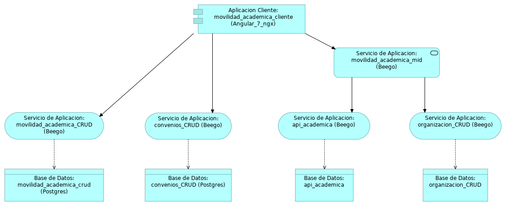

# Movilidad Academica MID

**movilidad_academica_mid**, MID del proyecto movilidad academica. El proyecto está escrito en el lenguaje Go, generado mediante el **[framework beego](https://beego.me/)**.

### Arquitectura del proyecto


Otros repositorios relacionados **[movilidad_academica_crud](https://github.com/udistrital/movilidad_academica_crud)** y  **[convenios_crud](https://github.com/udistrital/convenios_crud)**

# Instalación
Para instalar el proyecto de debe relizar lo siguientes pasos:

## Opción 1

Ejecutar desde la terminal 'go get repositorio':
```shell 
go get github.com/udistrital/movilidad_academica_mid.git
```

## Opción 2

1. Clonar en el proyecto en la carpeta local: go/src/github.com/udistrital:
```shell
cd ~go/src/github.com/udistrital 
```

2. Ejecutar:

```shell 
git clone https://github.com/udistrital/movilidad_academica_mid.git
```

3. Ir a la carpeta del proyecto
```shell 
cd movilidad_academica_mid
```

4. Instalar dependencias del proyecto:
```shell 
got get
```


# Ejecución del proyecto
Ubicado en la raíz del proyecto,
```shell 
cd ~/go/src/github.com/udistrital/movilidad_academica_mid

```

- Ejecutar: 
```shell 
bee run
```
- O si se quiere ejecutar el swager:

```shell 
bee run -downdoc=true -gendoc=true
```

### Puertos
* El servidor se expone en el puerto: 127.0.0.1:8081

* Para ver la documentación de swagger: [127.0.0.1:8081/swagger/](http://127.0.0.1:8081/swagger/)

### EndPoints
|                |link de prueba                  |End Point|
|----------------|-------------------------------|------------------------|
| **Obtiene datos asociados a la información academica** | [GetAcademica](http://127.0.0.1:8081/v1/academica/GetAcademica) |`127.0.0.1:8081/v1/academica/GetAcademica`|
| **Obtiene datos asociados a los convenios** |[GetConvenio](http://127.0.0.1:8081/v1/convenio/GetConvenio)| `127.0.0.1:8081/v1/convenio/GetConvenio` |
| **Obtiene datos asociados a la movilidad estudiantil** |[GetMovilidad](http://127.0.0.1:8081/v1/movilidad/GetMovilidad)| `127.0.0.1:8081/v1/movilidad/GetMovilidad` |


